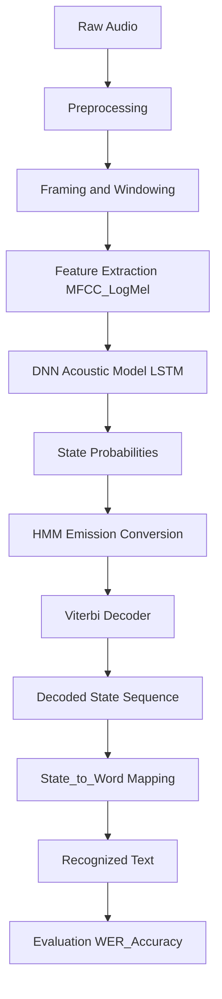

# HMM-DNN Based Automatic Speech Recognition

## Assignment Topic

Hybrid Automatic Speech Recognition (ASR) System using a Deep Neural Network (DNN) acoustic model integrated with a Hidden Markov Model (HMM) for sequence decoding.

---

## Project Summary

This repository implements a hybrid HMM-DNN ASR pipeline (demo-quality) that walks through:

- Speech preprocessing and framing
- MFCC and Log-Mel feature extraction
- A small LSTM-based DNN acoustic model that predicts acoustic states
- Conversion of DNN outputs to HMM emission probabilities
- HMM transition matrix construction and Viterbi decoding
- Mapping decoded states to words and computing Word Error Rate (WER)

The primary goal is educational: to demonstrate how frame-level neural acoustic scores can be combined with HMM sequence modeling and Viterbi decoding for ASR.

## Dataset

Dataset used in the notebook:

- LibriSpeech ASR Corpus (test-clean subset)

Files of interest:

- HMM-DNN_Group09.ipynb — Jupyter notebook containing the full assignment steps and runnable code
- HMM-DNN_Group09.html — exported HTML version of the notebook

---

## Setup

Create a Python virtual environment and install the main dependencies used by the notebook. The `requirements.txt` in this repo is empty, so the notebook relies on common ML/audio packages listed below.

Run these commands on macOS / Linux (or adjust for Windows):

```bash
python3 -m venv .venv
source .venv/bin/activate
pip install --upgrade pip
pip install torch torchaudio matplotlib numpy pandas jiwer
```

Notes:

- Use a matching `torch`/`torchaudio` wheel for your CUDA or CPU setup if needed. See PyTorch install page for platform-specific instructions.
- If `torchaudio.datasets.LIBRISPEECH` is used, the dataset will download (~100s of MB) to `./data` when the notebook is executed.

---

## How to run

- Open and run the notebook: [HMM-DNN_Group09.ipynb](HMM-DNN_Group09.ipynb)
- The notebook is organized into numbered steps (feature extraction → model → HMM → decoding → evaluation).

Quick commands to launch Jupyter:

```bash
source .venv/bin/activate
jupyter lab   # or jupyter notebook
```

---

## Architecture Diagram

The following Mermaid flowchart shows the high-level pipeline used by the assignment.



---

## Key Learnings

- How to preprocess speech: normalizing, framing, and windowing.
- Feature extraction: MFCC and Log-Mel spectrogram representations for acoustic modeling.
- Acoustic modeling with a sequence model (LSTM) and how its frame-level outputs can be converted to emission probabilities for an HMM.
- Building a simple HMM transition matrix and implementing Viterbi decoding for sequence inference.
- End-to-end evaluation with Word Error Rate (`jiwer`) and how mapping states→words is a simplified proxy for real phoneme/lexicon-level decoding.

---

## Project Structure

- [HMM-DNN_Group09.ipynb](HMM-DNN_Group09.ipynb) — Main notebook (runnable)
- [HMM-DNN_Group09.html](HMM-DNN_Group09.html) — Exported HTML of the notebook
- README.md — This file
- requirements.txt — (currently empty; see Setup section for packages)

---

## Notes & Next Steps

- If you want this to be a reproducible demo, I can: generate a `requirements.txt` with pinned versions, extract the notebook code into .py scripts, or add a small example audio file and expected WER results. Tell me which you'd prefer.

